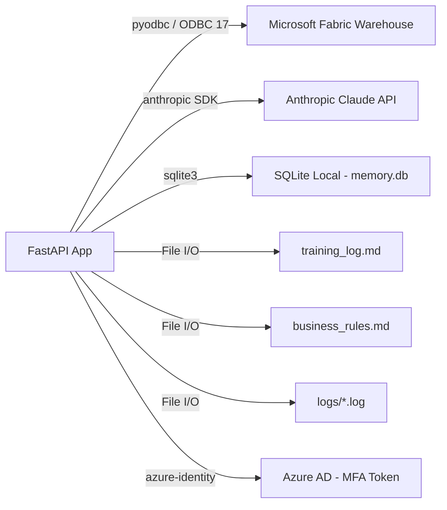
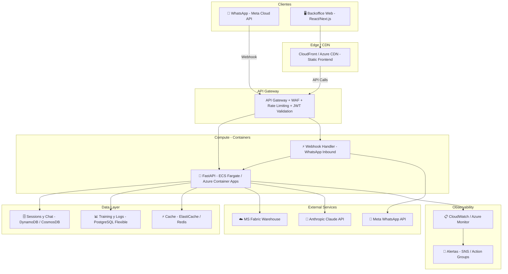
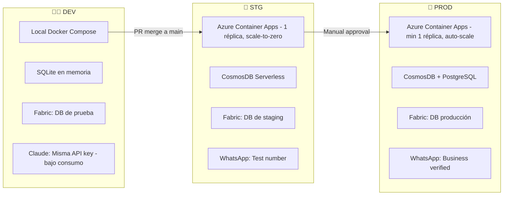
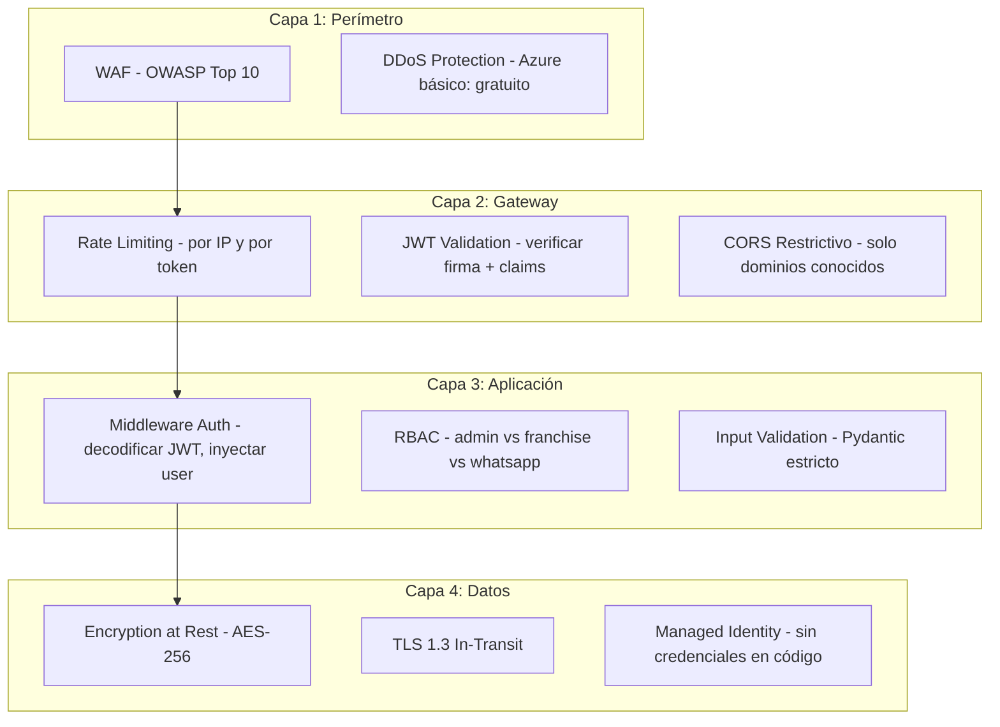
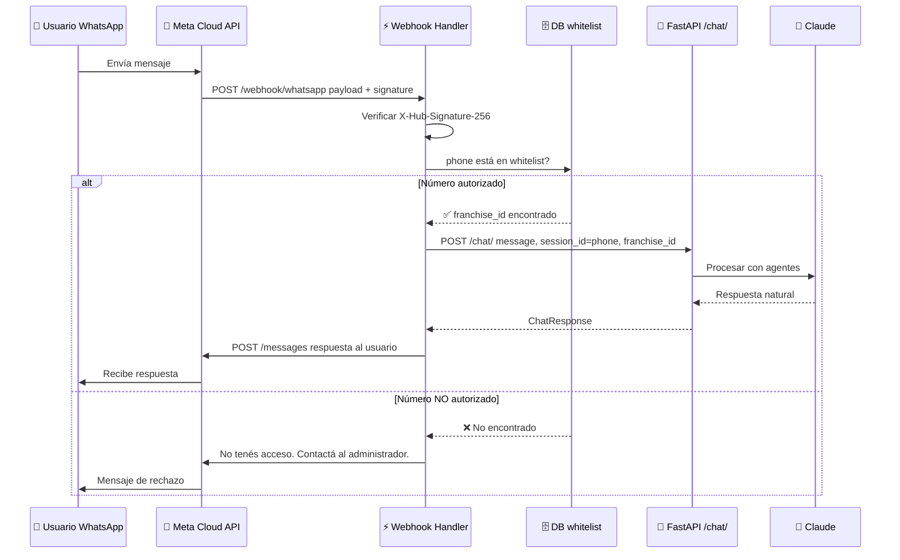
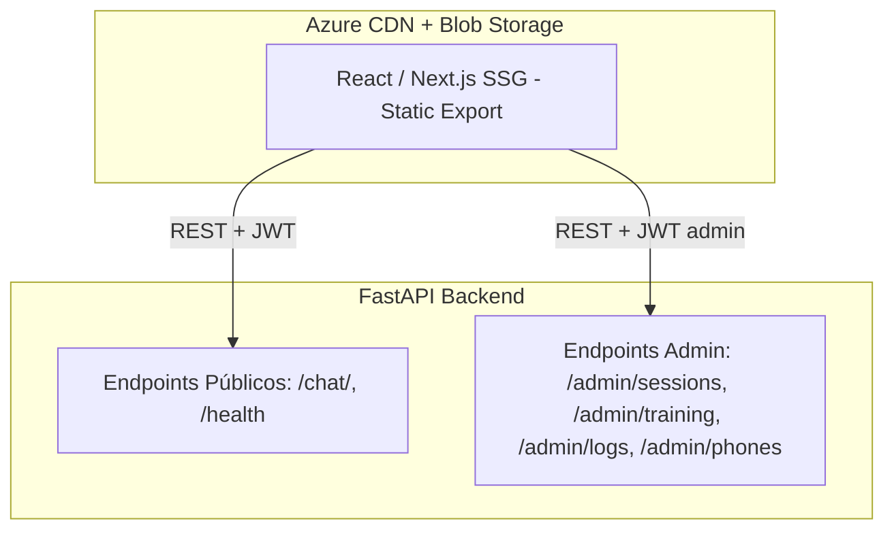
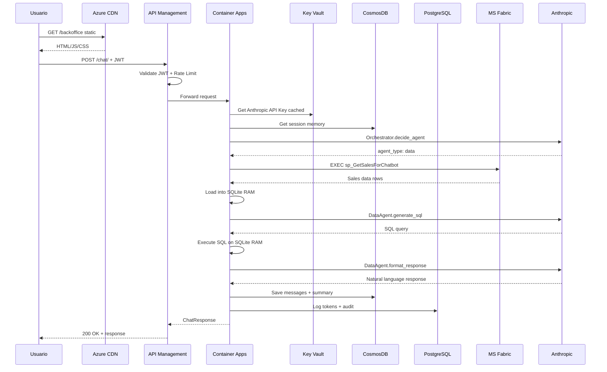

# 🏗️ Plan Maestro de Infraestructura y Arquitectura

## Chatbot Multi-Agente — De Desarrollo Local a Producción Cloud

> **Fecha:** 2026-04-19  
> **Versión:** 1.0  
> **Audiencia:** Equipo de desarrollo, arquitectura, DevOps

---

## Tabla de Contenidos

1. [Diagnóstico del Estado Actual](#1-diagnóstico-del-estado-actual)
2. [Arquitectura Objetivo](#2-arquitectura-objetivo)
3. [Comparativa Cloud: AWS vs Azure](#3-comparativa-cloud-aws-vs-azure)
4. [Estrategia Multi-Ambiente](#4-estrategia-multi-ambiente-dev--stg--prod)
5. [Seguridad y Autenticación](#5-seguridad-y-autenticación)
6. [Base de Datos — Migración y Diseño](#6-base-de-datos--migración-y-diseño)
7. [Integración WhatsApp](#7-integración-whatsapp)
8. [Backoffice / Frontend](#8-backoffice--frontend)
9. [Observabilidad y Logging](#9-observabilidad-y-logging)
10. [Cambios de Código Necesarios](#10-cambios-de-código-necesarios)
11. [Roadmap por Fases](#11-roadmap-por-fases)
12. [Estimación de Costos](#12-estimación-de-costos)
13. [Checklist de Producción](#13-checklist-de-producción)

---

## 1. Diagnóstico del Estado Actual

### 1.1 Fortalezas Identificadas

| Aspecto | Estado | Detalle |
|---------|--------|---------|
| Arquitectura de Agentes | ✅ Sólida | Patrón Orchestrator → Sub-agents bien definido (Sonnet routing → Haiku execution) |
| Separación de responsabilidades | ✅ Buena | Routers, Agents, DB Repos, Models bien separados |
| Seguridad de datos | ✅ Inteligente | El LLM nunca toca Fabric directo; opera sobre SQLite efímera en RAM |
| Business Rules como contexto | ✅ Flexible | Inyección dinámica desde `business_rules.md` |
| Training System | ✅ Innovador | Ciclo feedback → sugerencia → inyección en prompts |
| Configuración | ✅ Correcta | Pydantic Settings + dotenv |

### 1.2 Deudas Técnicas y Gaps para Producción

| Problema | Severidad | Archivo(s) Afectado(s) |
|----------|-----------|------------------------|
| **CORS abierto a `*`** | 🔴 Crítica | [main.py](file:///c:/Users/matiasa/Documents/Agent/app/main.py#L42-L48) |
| **Sin autenticación** — cualquier persona puede llamar a la API | 🔴 Crítica | [chat.py](file:///c:/Users/matiasa/Documents/Agent/app/routers/chat.py), todos los endpoints |
| **Sin rate limiting real** — `api_rate_limit` configurado pero no aplicado | 🔴 Crítica | [config.py](file:///c:/Users/matiasa/Documents/Agent/app/config.py#L25) (declarado, no implementado) |
| **SQLite en archivo como DB principal** — no escala ni es concurrente | 🟡 Alta | [memory_repo.py](file:///c:/Users/matiasa/Documents/Agent/app/db/memory_repo.py), `memory.db` |
| **Training log en archivo `.md`** — se pierde en cada deploy | 🟡 Alta | [training_repo.py](file:///c:/Users/matiasa/Documents/Agent/app/db/training_repo.py), `context/training_log.md` |
| **Logs en archivos locales** — inaccesibles en cloud, se pierden | 🟡 Alta | [logger.py](file:///c:/Users/matiasa/Documents/Agent/app/logger.py), `logs/` |
| **`print()` como principal mecanismo de log** | 🟡 Alta | Todos los agentes |
| **Sin Dockerfile ni containerización** | 🟡 Alta | Raíz del proyecto |
| **UI test servida desde el mismo server** — acoplamiento | 🟠 Media | [main.py](file:///c:/Users/matiasa/Documents/Agent/app/main.py#L68-L70) |
| **Credenciales de Azure AD interactiva** — imposible en servidor | 🟠 Media | [connection.py](file:///c:/Users/matiasa/Documents/Agent/app/db/connection.py) |
| **Dumper a localhost SQLEXPRESS** — herramienta dev-only | 🟢 Baja | [data_agent.py](file:///c:/Users/matiasa/Documents/Agent/app/agents/data_agent.py#L288-L313) |
| **Sin health checks profundos** (DB connectivity, Anthropic reachability) | 🟢 Baja | [main.py](file:///c:/Users/matiasa/Documents/Agent/app/main.py#L62-L64) |

### 1.3 Mapa de Dependencias Externas Actuales



---

## 2. Arquitectura Objetivo

### 2.1 Vista de Alto Nivel



### 2.2 Principios de Diseño

| Principio | Aplicación en este Proyecto |
|-----------|---------------------------|
| **Twelve-Factor App** | Config via env vars, stateless processes, logs como streams |
| **API-First** | Toda funcionalidad expuesta via REST; frontend y WhatsApp son consumidores iguales |
| **Separation of Concerns** | Frontend (CDN) ≠ API (Containers) ≠ Data (Managed DBs) |
| **Least Privilege** | Cada servicio solo accede a lo que necesita (IAM roles, network policies) |
| **Infrastructure as Code** | Terraform/Bicep para reproducibilidad entre ambientes |
| **Immutable Deployments** | Docker images versionadas, no hot-patching en servidor |
| **Cost Consciousness** | Serverless-first para etapa inicial, escalado manual después |

---

## 3. Comparativa Cloud: AWS vs Azure

### 3.1 Tabla Comparativa por Servicio

| Necesidad | AWS | Azure | Recomendación |
|-----------|-----|-------|---------------|
| **Contenedores** | ECS Fargate | Azure Container Apps (ACA) | **Azure ACA** — scale-to-zero nativo, billing por segundo |
| **API Gateway** | API Gateway v2 | Azure API Management (Consumption) | Ambos sirven; Azure APIM tiene ventaja en políticas |
| **CDN / Static** | CloudFront + S3 | Azure CDN + Blob Storage | Equivalentes; Azure si el ecosistema ya es Azure |
| **Base NoSQL** | DynamoDB | CosmosDB (serverless) | **CosmosDB Serverless** — pago por operación, ideal bajo volumen |
| **Base Relacional** | RDS PostgreSQL | Azure Database for PostgreSQL Flexible | **Azure Flexible** — tiene tier gratuito (B1ms burstable) |
| **Cache** | ElastiCache Redis | Azure Cache for Redis | Postergar hasta que haya necesidad real |
| **Secrets** | AWS Secrets Manager | Azure Key Vault | **Key Vault** — más económico ($0.03/10k ops) |
| **Logging** | CloudWatch Logs | Azure Monitor + Log Analytics | Azure Monitor si el resto está en Azure |
| **CI/CD** | CodePipeline + CodeBuild | Azure DevOps / GitHub Actions | **GitHub Actions** — gratuito para repos privados hasta cierto límite |
| **IaC** | Terraform / CloudFormation | Terraform / Bicep | Terraform para portabilidad |
| **Conexión a Fabric** | VPN / Private Endpoint | **Native** — misma red Azure | ✅ **Ventaja decisiva de Azure** |

### 3.2 Recomendación Final: **Azure** ☁️

> [!IMPORTANT]
> **Azure es la elección natural y justificada** por tres razones de peso:
>
> 1. **Microsoft Fabric ya vive en Azure** — La conexión API → Fabric será via private endpoint dentro de la misma red virtual, eliminando latencia de internet y costos de egress.
> 2. **Azure AD ya se usa** para autenticación a Fabric — reutilizar la identidad existente via Managed Identity elimina el problema actual de `InteractiveBrowserCredential` (que no funciona en servidor).
> 3. **Costos iniciales más bajos** — Azure Container Apps tiene scale-to-zero real (pago $0 cuando nadie usa el bot), CosmosDB Serverless cobra por operación y PostgreSQL Flexible tiene tier burstable económico.

---

## 4. Estrategia Multi-Ambiente (Dev / Stg / Prod)

### 4.1 Definición de Ambientes



### 4.2 Variables de Entorno por Ambiente

```bash
# === .env.dev (local) ===
FASTAPI_ENV=development
FASTAPI_DEBUG=true
DB_SERVER=localhost\SQLEXPRESS              # o Fabric de prueba
DB_AUTH_MODE=sql
ANTHROPIC_API_KEY=sk-ant-xxx
MEMORY_DB_PATH=./memory.db                  # SQLite local
CORS_ORIGINS=http://localhost:3000,http://localhost:8000
LOG_LEVEL=DEBUG
WHATSAPP_VERIFY_TOKEN=dev-token-123

# === .env.stg (Azure) ===
FASTAPI_ENV=staging
FASTAPI_DEBUG=false
DB_SERVER=fabric-stg.database.windows.net
DB_AUTH_MODE=managedidentity                # NUEVO modo
ANTHROPIC_API_KEY=@Microsoft.KeyVault(...)  # Referencia a Key Vault
COSMOS_CONNECTION_STRING=@Microsoft.KeyVault(...)
POSTGRES_CONNECTION_STRING=@Microsoft.KeyVault(...)
CORS_ORIGINS=https://stg-backoffice.company.com
LOG_LEVEL=INFO
WHATSAPP_VERIFY_TOKEN=@Microsoft.KeyVault(...)
WHATSAPP_ACCESS_TOKEN=@Microsoft.KeyVault(...)
WHATSAPP_PHONE_NUMBER_ID=xxx

# === .env.prod (Azure) ===
FASTAPI_ENV=production
FASTAPI_DEBUG=false
DB_AUTH_MODE=managedidentity
# ... misma estructura, distintos valores y permisos más restrictivos
```

### 4.3 Docker Compose para Desarrollo Local

```yaml
# docker-compose.dev.yml (referencia - no código final)
version: "3.9"
services:
  api:
    build: .
    ports: ["8000:8000"]
    env_file: .env.dev
    volumes:
      - ./app:/app/app          # Hot reload
      - ./context:/app/context  # Business rules live
    command: uvicorn app.main:app --host 0.0.0.0 --reload

  # Opcional: PostgreSQL local para simular prod
  postgres:
    image: postgres:16-alpine
    environment:
      POSTGRES_DB: chatbot_logs
      POSTGRES_USER: dev
      POSTGRES_PASSWORD: dev123
    ports: ["5432:5432"]
```

### 4.4 Branching Strategy Recomendada

```
main ──────────────────────────── (protegido, deploy a STG automático)
  │
  ├── feature/whatsapp-integration
  ├── feature/jwt-auth
  ├── feature/cosmos-migration
  │
  └── release/v1.0.0 ─────────── (tag → deploy manual a PROD)
```

---

## 5. Seguridad y Autenticación

### 5.1 Capas de Seguridad



### 5.2 Autenticación — JWT para la API

**Flujo de autenticación propuesto:**

```
1. Backoffice: Login → Azure AD B2C → JWT con claims {role, franchise_id, user_id}
2. WhatsApp: Webhook verificado por Meta → Token de servicio interno (API Key)
3. API: Middleware valida JWT/API Key → Extrae identity → Inyecta en request context
```

**Roles definidos:**

| Rol | Acceso | Canal |
|-----|--------|-------|
| `admin` | Todo: chat, training, logs, sesiones, debug, reentrenamiento | Backoffice |
| `franchise_user` | Chat propio, historial propio | WhatsApp + Backoffice |
| `developer` | Logs, debug, training mode, simulación | Backoffice |
| `whatsapp_service` | Solo `POST /chat/` con franchise_id validado | Service-to-service |

### 5.3 Seguridad de la Conexión WhatsApp

| Control | Implementación |
|---------|---------------|
| **Verificación de webhook** | Token de verificación en Meta → validado en el handler |
| **Firma de payload** | Verificar `X-Hub-Signature-256` con HMAC-SHA256 del app secret |
| **Whitelist de números** | Tabla en DB: `allowed_phones(phone, franchise_id, active, created_at)` |
| **Rate limit por teléfono** | Máximo N mensajes/minuto por número (prevenir abuso) |
| **Sanitización de input** | Strip de caracteres peligrosos antes de enviar al LLM |

### 5.4 Protección de API Keys Externas

| Secreto | Dónde guardar | Cómo acceder |
|---------|--------------|--------------|
| `ANTHROPIC_API_KEY` | Azure Key Vault | Referencia desde App Settings |
| `WHATSAPP_ACCESS_TOKEN` | Azure Key Vault | Managed Identity → Key Vault |
| `DB_PASSWORD` (si aplica) | Azure Key Vault | Managed Identity (preferido) |
| `COSMOS_CONNECTION_STRING` | Azure Key Vault | Managed Identity → RBAC |

> [!WARNING]
> **Nunca** commitear `.env` con secretos reales. El `.gitignore` actual ya lo previene, pero reforzar con pre-commit hooks que detecten secrets (ej: `detect-secrets` de Yelp).

### 5.5 CORS — Configuración por Ambiente

```python
# Recomendación conceptual:
# En lugar de allow_origins=["*"], usar:
CORS_ORIGINS = {
    "development": ["http://localhost:3000", "http://localhost:8000"],
    "staging":     ["https://stg-backoffice.company.com"],
    "production":  ["https://backoffice.company.com"],
}
```

---

## 6. Base de Datos — Migración y Diseño

### 6.1 Análisis de Necesidades de Almacenamiento

| Dato | Volumen Esperado | Patrón de Acceso | Estructura | DB Recomendada |
|------|-----------------|-------------------|------------|----------------|
| **Sesiones de chat** (messages) | Alto: miles/día en prod | Write-heavy, read por session_id | Documento flexible (role, content, metadata) | **CosmosDB** (NoSQL) |
| **Memoria de contexto** (summaries) | Medio: 1 por sesión | Read-heavy, lookup por session_id | Documento | **CosmosDB** |
| **Training log** (sugerencias) | Bajo: decenas/semana | Append-only, read secuencial | Estructurado | **PostgreSQL** |
| **Query logs** (tokens, audit) | Medio: 1 por request | Append-only, queries analíticas | Tabular, time-series | **PostgreSQL** |
| **WhatsApp phone whitelist** | Bajo: lista estática | Read-heavy, lookup por phone | Tabular | **PostgreSQL** |
| **User/Franchise mapping** | Bajo: configuración | Read-only en runtime | Tabular | **PostgreSQL** |
| **Business Rules** | Estático | Read-only, cache en RAM | Texto | **Archivo en imagen Docker + hot reload** |

### 6.2 Diseño CosmosDB (Sesiones — NoSQL)

**¿Por qué CosmosDB Serverless?**
- Pago por Request Unit (RU), no por hora. Ideal para bajo volumen inicial.
- Modelo de documento flexible: cada mensaje puede tener metadata variable.
- Partition key = `session_id` → acceso O(1) a toda la conversación.
- TTL automático: sesiones viejas se auto-eliminan (ej: 90 días).

**Modelo de documento propuesto:**

```json
{
  "id": "auto-generated",
  "session_id": "1776381511174",
  "franchise_id": "4066b2def050...",
  "user_id": "matias",
  "source": "whatsapp",
  "phone_number": "+5491155...",
  "messages": [
    {
      "role": "user",
      "content": "¿Cuántas ventas hubo hoy?",
      "timestamp": "2026-04-19T15:30:00-03:00"
    },
    {
      "role": "assistant",
      "content": "Hoy se registraron 145 transacciones...",
      "agent_type": "data",
      "timestamp": "2026-04-19T15:30:05-03:00"
    }
  ],
  "summary": "Consulta sobre ventas del día...",
  "training_mode": true,
  "created_at": "2026-04-19T15:30:00-03:00",
  "updated_at": "2026-04-19T15:35:00-03:00",
  "ttl": 7776000
}
```

### 6.3 Diseño PostgreSQL (Operacional — Relacional)

```sql
-- Tabla: training_suggestions (reemplaza training_log.md)
CREATE TABLE training_suggestions (
    id             SERIAL PRIMARY KEY,
    session_id     TEXT NOT NULL,
    type           TEXT CHECK(type IN ('positivo', 'negativo')),
    user_message   TEXT,
    agent_response TEXT,
    feedback       TEXT,
    component      TEXT CHECK(component IN ('data_agent', 'orchestrator', 'interaction', 'business_rules', 'unknown')),
    cause          TEXT,
    suggestion     TEXT,
    priority       TEXT CHECK(priority IN ('alta', 'media', 'baja')),
    status         TEXT DEFAULT 'pending' CHECK(status IN ('pending', 'applied', 'rejected', 'archived')),
    applied_by     TEXT,
    applied_at     TIMESTAMPTZ,
    created_at     TIMESTAMPTZ DEFAULT NOW()
);

-- Tabla: query_logs (reemplaza tabla SQLite)
CREATE TABLE query_logs (
    id             SERIAL PRIMARY KEY,
    session_id     TEXT NOT NULL,
    user_message   TEXT,
    agent_type     TEXT,
    input_tokens   INTEGER DEFAULT 0,
    output_tokens  INTEGER DEFAULT 0,
    total_tokens   INTEGER GENERATED ALWAYS AS (input_tokens + output_tokens) STORED,
    response_ms    INTEGER,
    created_at     TIMESTAMPTZ DEFAULT NOW()
);
CREATE INDEX idx_query_logs_created ON query_logs(created_at DESC);

-- Tabla: whatsapp_phones (whitelist de acceso)
CREATE TABLE whatsapp_phones (
    id              SERIAL PRIMARY KEY,
    phone_number    TEXT NOT NULL UNIQUE,
    franchise_id    TEXT NOT NULL,
    display_name    TEXT,
    active          BOOLEAN DEFAULT true,
    created_at      TIMESTAMPTZ DEFAULT NOW(),
    deactivated_at  TIMESTAMPTZ
);

-- Tabla: api_keys (para service-to-service auth)
CREATE TABLE api_keys (
    id             SERIAL PRIMARY KEY,
    key_hash       TEXT NOT NULL UNIQUE,
    name           TEXT NOT NULL,
    role           TEXT CHECK(role IN ('admin', 'developer', 'whatsapp_service')),
    franchise_id   TEXT,
    active         BOOLEAN DEFAULT true,
    created_at     TIMESTAMPTZ DEFAULT NOW(),
    last_used_at   TIMESTAMPTZ
);
```

### 6.4 Migración Gradual desde SQLite

> [!TIP]
> No migrar todo de golpe. La estrategia recomendada es **Strangler Fig Pattern**: ir redirigiendo uno por uno los repositorios a la nueva DB mientras el viejo sigue funcionando como fallback.

| Fase | Componente | De → A | Prioridad |
|------|-----------|--------|-----------|
| 1 | `memory_repo` (chat_messages, chatbot_memory) | SQLite → CosmosDB | Alta |
| 2 | `training_repo` | Archivo `.md` → PostgreSQL | Alta |
| 3 | `query_logs` | SQLite → PostgreSQL | Media |
| 4 | `business_rules.md` | Archivo → Archivo en Docker image + endpoint de hot reload | Baja |

---

## 7. Integración WhatsApp

### 7.1 Arquitectura de Integración



### 7.2 Meta Cloud API — Qué se Necesita

| Requisito | Detalle | Costo |
|-----------|---------|-------|
| **Meta Business Account** | Cuenta verificada de empresa | Gratis |
| **App en Meta for Developers** | Crear app con producto "WhatsApp" | Gratis |
| **Número de teléfono de prueba** | Meta provee uno para sandbox | Gratis |
| **Número de negocio verificado** | Para producción, necesitás un número propio | ~$0 (solo verificación) |
| **Conversaciones** | 1.000 conversaciones service-initiated gratis/mes. User-initiated: varía por país | ~$0.03-0.08 USD/conversación después del free tier |

### 7.3 Webhook Handler — Nuevo Módulo

Se necesita crear un nuevo router `app/routers/whatsapp.py` con:

1. **`GET /webhook/whatsapp`** — Verification challenge de Meta (modo subscribe)
2. **`POST /webhook/whatsapp`** — Recibe mensajes entrantes
3. **Validación de firma** — `X-Hub-Signature-256` HMAC
4. **Mapeo phone → franchise_id** via tabla de whitelist
5. **Adaptador a `ChatRequest`** — Convertir formato WhatsApp a formato interno
6. **Respuesta async** — El webhook debe responder 200 inmediato, procesar en background
7. **Envío de respuesta** — `POST` al endpoint de Meta para enviar el mensaje de vuelta
8. **Manejo de media** — Inicialmente ignorar imágenes/audio, responder "Solo proceso texto"

### 7.4 Sesiones WhatsApp

- **`session_id`** = `whatsapp_{phone_number}` — una sesión por número de teléfono
- **TTL de conversación**: 24 horas de inactividad → nueva sesión (alineado con ventana de Meta)
- **Contexto**: El `memory_agent` ya maneja contexto por sesión; funciona transparente

---

## 8. Backoffice / Frontend

### 8.1 Arquitectura del Frontend



**¿Por qué "tipo CloudFront" (static hosting)?**
- El frontend se compila a archivos estáticos (HTML/JS/CSS)
- Se sube a Azure Blob Storage con CDN al frente
- No necesita servidor propio → costo ~$1-2/mes
- El frontend solo consume la API via `fetch()` con JWT en headers
- Completamente desacoplado: puede cambiar de framework sin tocar el backend

### 8.2 Funcionalidades del Backoffice

| Módulo | Descripción | Rol Requerido |
|--------|-------------|---------------|
| **💬 Chat Playground** | Interfaz de chat para probar el bot en tiempo real | `developer`, `admin` |
| **📊 Dashboard de Sesiones** | Ver todas las sesiones activas, filtrar por franquicia/fecha/canal | `admin` |
| **🔍 Visor de Sesión** | Inspeccionar conversación completa de cualquier sesión, con metadata de agente | `admin`, `developer` |
| **📈 Token Analytics** | Gráficos de consumo de tokens por agente/día/franquicia | `admin` |
| **🎓 Training Console** | Ver sugerencias pendientes, aplicar/rechazar, ver historial | `admin`, `developer` |
| **⚙️ Gestión de Reglas** | Editar `business_rules.md` via editor web con preview | `admin` |
| **📱 WhatsApp Phones** | CRUD de números autorizados, asignar a franquicia | `admin` |
| **🔑 API Keys** | Generar/revocar API keys para integraciones | `admin` |
| **📋 Logs en Vivo** | Streaming de logs de la aplicación (WebSocket) | `developer` |

### 8.3 Endpoints Nuevos Necesarios para el Backoffice

```
# Sessions & Observability
GET    /admin/sessions?franchise_id=&date_from=&date_to=&source=
GET    /admin/sessions/{session_id}/full
GET    /admin/analytics/tokens?group_by=day&franchise_id=

# Training Management
GET    /admin/training/suggestions?status=pending&priority=alta
PATCH  /admin/training/suggestions/{id}  {status: "applied"|"rejected"}
GET    /admin/training/rules              → retorna business_rules.md como texto
PUT    /admin/training/rules              → actualiza business_rules.md

# WhatsApp Phone Management
GET    /admin/phones
POST   /admin/phones  {phone_number, franchise_id, display_name}
PATCH  /admin/phones/{id}  {active: false}
DELETE /admin/phones/{id}

# API Key Management
GET    /admin/api-keys
POST   /admin/api-keys  {name, role, franchise_id}
DELETE /admin/api-keys/{id}
```

---

## 9. Observabilidad y Logging

### 9.1 Estrategia de Logging Centralizado

| Estado Actual | Estado Objetivo |
|--------------|-----------------|
| `print()` en consola | **Structured JSON logging** via `structlog` o `python-json-logger` |
| Archivos `.log` por sesión | **Azure Monitor / Log Analytics** (CloudWatch en AWS) |
| Logs de training en `.md` | **PostgreSQL** con query capabilities |
| Sin métricas | **Prometheus-compatible metrics** (via `prometheus-fastapi-instrumentator`) |
| Sin alertas | **Alertas** por errores de Anthropic, latencia alta, token budget excedido |

### 9.2 Estructura de Log Recomendada

```json
{
  "timestamp": "2026-04-19T15:30:05.123-03:00",
  "level": "INFO",
  "service": "chatbot-api",
  "environment": "production",
  "trace_id": "abc-123-def",
  "session_id": "whatsapp_5491155001234",
  "franchise_id": "4066b2def050...",
  "agent": "data_agent",
  "step": "sql_generation",
  "message": "SQL generado exitosamente",
  "metadata": {
    "sql": "SELECT COUNT(*) FROM ventas WHERE...",
    "rows_returned": 145,
    "input_tokens": 512,
    "output_tokens": 45,
    "duration_ms": 1230
  }
}
```

### 9.3 Métricas Clave a Monitorear

| Métrica | Alerta si... | Acción |
|---------|-------------|--------|
| `request_latency_p95` | > 10 segundos | Investigar Fabric o Claude |
| `anthropic_errors_rate` | > 5% en 5 min | Verificar API key, quota |
| `daily_token_usage` | > presupuesto diario | Notificar, considerar throttle |
| `whatsapp_webhook_failures` | > 0 en 1 hora | Verificar configuración Meta |
| `active_sessions` | > 100 simultáneas | Preparar scaling |
| `db_connection_errors` | > 0 en 5 min | Verificar Fabric/Cosmos |

---

## 10. Cambios de Código Necesarios

> [!NOTE]
> Esta sección no incluye código sino la lista categorizada de cambios. La implementación se hará en fases según el roadmap.

### 10.1 Cambios Críticos (Fase 0-1)

| # | Cambio | Archivo(s) | Justificación |
|---|--------|-----------|---------------|
| 1 | **Crear `Dockerfile`** con Python 3.12 slim, ODBC Driver 17, multi-stage build | Raíz | Containerización básica |
| 2 | **Agregar `docker-compose.yml`** para dev local | Raíz | Reproducibilidad entre devs |
| 3 | **Crear middleware JWT** con verificación de firma y extracción de claims | `app/middleware/auth.py` (nuevo) | Seguridad básica |
| 4 | **Restringir CORS** por ambiente via config | `app/main.py` | Eliminar `allow_origins=["*"]` |
| 5 | **Implementar rate limiting** real con `slowapi` o `fastapi-limiter` | `app/main.py`, `requirements.txt` | Prevenir abuso |
| 6 | **Reemplazar `print()` por `logging` estructurado** en todos los agentes | Todos los archivos de `agents/` | Observabilidad en cloud |
| 7 | **Agregar modo `managedidentity`** en `connection.py` | `app/db/connection.py` | Eliminar dependencia de browser auth |
| 8 | **Crear `.env.example` completo** con todas las variables nuevas | `.env.example` | Onboarding de devs |

### 10.2 Cambios de Migración (Fase 2-3)

| # | Cambio | Archivo(s) | Justificación |
|---|--------|-----------|---------------|
| 9 | **Crear adaptador CosmosDB** para sesiones/mensajes | `app/db/cosmos_repo.py` (nuevo) | Reemplazar SQLite para chat |
| 10 | **Crear adaptador PostgreSQL** para training y logs | `app/db/postgres_repo.py` (nuevo) | Reemplazar archivos y SQLite |
| 11 | **Abstraer repos con interfaces** para que el switch sea transparente | `app/db/base.py` (nuevo) | Poder usar SQLite en dev, Cosmos en prod |
| 12 | **Crear router WhatsApp** con webhook handler | `app/routers/whatsapp.py` (nuevo) | Integración Meta Cloud API |
| 13 | **Crear router Admin** con endpoints de backoffice | `app/routers/admin.py` (nuevo) | Panel de administración |
| 14 | **Desmontar UI estática** del servidor FastAPI | `app/main.py` | Desacoplar frontend |

### 10.3 Cambios de Hardening (Fase 3-4)

| # | Cambio | Archivo(s) | Justificación |
|---|--------|-----------|---------------|
| 15 | **Agregar health check profundo** (DB, Anthropic, Fabric) | `app/routers/health.py` (nuevo) | Detección de problemas |
| 16 | **Eliminar dumper SQLEXPRESS** o condicionarlo a `FASTAPI_ENV=development` | `app/agents/data_agent.py` | No aplica en cloud |
| 17 | **Agregar request tracing** con `trace_id` en headers | Middleware nuevo | Correlación de logs |
| 18 | **Implementar circuit breaker** para Anthropic y Fabric | Wrapper en agentes | Resiliencia |
| 19 | **Agregar Prometheus metrics** endpoint | `app/main.py` | Monitoreo |
| 20 | **Crear `alembic` migrations** para PostgreSQL | `alembic/` (nuevo) | Migraciones de esquema controladas |

---

## 11. Roadmap por Fases

### Fase 0: Foundation (1-2 semanas)
**Objetivo:** Preparar el proyecto para poder ser containerizado y desplegado.

- [ ] Crear `Dockerfile` multi-stage con ODBC Driver 17
- [ ] Crear `docker-compose.dev.yml` para desarrollo local
- [ ] Reemplazar `print()` por logging estructurado (JSON)
- [ ] Configurar CORS por ambiente
- [ ] Expandir `.env.example` con todas las variables
- [ ] Agregar `.dockerignore`
- [ ] Agregar `pre-commit` hooks (secrets detection, linting)

**Entregable:** `docker compose up` levanta el proyecto completo en cualquier máquina.

---

### Fase 1: Seguridad + Deploy STG (2-3 semanas)
**Objetivo:** Primera instancia accesible desde internet, segura.

- [ ] Implementar middleware JWT (Azure AD B2C o tokens autogenerados para MVP)
- [ ] Implementar rate limiting con `slowapi`
- [ ] Agregar modo `managedidentity` para conexión a Fabric
- [ ] Provisionar en Azure:
  - Azure Container Apps (1 réplica, scale-to-zero)
  - Azure Key Vault (secrets)
  - Azure Container Registry (para imágenes Docker)
- [ ] Configurar GitHub Actions:
  - Build → Push a ACR → Deploy a ACA (en merge a `main`)
- [ ] Configurar Azure Monitor + Log Analytics
- [ ] Primer deploy a STG funcional

**Entregable:** API accesible en `https://stg-api.company.com` con auth, logs centralizados.

---

### Fase 2: Data Migration + Backoffice MVP (3-4 semanas)
**Objetivo:** Base de datos persistente, primer backoffice funcional.

- [ ] Provisionar CosmosDB Serverless + PostgreSQL Flexible
- [ ] Crear adaptador `cosmos_repo.py` para sesiones
- [ ] Crear adaptador `postgres_repo.py` para training + logs
- [ ] Migrar `training_repo.py` de archivo `.md` a PostgreSQL
- [ ] Crear router `/admin/*` con endpoints de backoffice
- [ ] Desarrollar frontend Backoffice (React/Next.js):
  - Chat playground
  - Visor de sesiones
  - Training console
  - Token analytics básico
- [ ] Desplegar frontend estático en Azure Blob Storage + CDN

**Entregable:** Panel de backoffice funcional con chat de prueba, visor de sesiones y training console.

---

### Fase 3: WhatsApp Integration (2-3 semanas)
**Objetivo:** Primer cliente puede chatear via WhatsApp.

- [ ] Registrar app en Meta for Developers
- [ ] Crear router `whatsapp.py` con webhook handler
- [ ] Implementar verificación de firma HMAC
- [ ] Crear tabla `whatsapp_phones` y CRUD en admin
- [ ] Implementar mapeo `phone → franchise_id`
- [ ] Probar con número sandbox de Meta
- [ ] Agregar manejo de mensajes de media (responder "solo texto")
- [ ] Integrar con número de producción (requiere verificación de negocio)

**Entregable:** Un franquiciado autorizado puede escribir por WhatsApp y recibir datos de ventas.

---

### Fase 4: Production Hardening (2-3 semanas)
**Objetivo:** Listo para escalar con confianza.

- [ ] Health check profundo (Fabric, Anthropic, Cosmos, PostgreSQL)
- [ ] Circuit breaker para servicios externos
- [ ] Alertas configuradas (Anthropic errors, latencia, token budget)
- [ ] Prometheus metrics + dashboard Grafana o Azure Dashboard
- [ ] Backup automático de CosmosDB y PostgreSQL
- [ ] Disaster recovery plan documentado
- [ ] Penetration testing básico
- [ ] Load testing con `locust` o `k6`
- [ ] Documentación de API con OpenAPI spec completa
- [ ] Runbook de operaciones

**Entregable:** Go-live de producción con confianza operativa.

---

### Fase 5: Evolución (Continuo)
- [ ] Agregar soporte para mensajes de voz WhatsApp (Speech-to-Text)
- [ ] Implementar cola de mensajes (Azure Service Bus) para alta concurrencia
- [ ] Agregar WebSocket para chat en tiempo real en el backoffice
- [ ] A/B testing de prompts
- [ ] Dashboard de satisfacción de franquiciados
- [ ] Multi-tenancy real (data isolation por franquicia)
- [ ] Evaluación de LLM alternatives (Azure OpenAI, Gemini) como fallback

---

## 12. Estimación de Costos

### 12.1 Fase Inicial (STG — Bajo Volumen)

| Servicio Azure | Configuración | Costo Mensual Estimado |
|---------------|---------------|----------------------|
| **Container Apps** | 1 réplica, scale-to-zero, 0.5 vCPU / 1GB RAM | ~$5-15 |
| **Container Registry** | Basic tier | ~$5 |
| **CosmosDB Serverless** | ~10K RU/día (pocas sesiones) | ~$1-5 |
| **PostgreSQL Flexible** | Burstable B1ms (1 vCPU, 2GB) | ~$13 |
| **Key Vault** | Standard, < 10K ops/mes | ~$0.03 |
| **Blob Storage + CDN** | Frontend estático, < 1GB | ~$1-2 |
| **Log Analytics** | < 5GB/mes ingestion | Gratis (first 5GB) |
| **Anthropic Claude** | Haiku: ~$0.25/1M input tokens | Variable, ~$10-30 con uso moderado |
| **WhatsApp (Meta)** | 1.000 conversaciones gratis/mes | $0 (dentro del tier) |
| **Dominio + DNS** | Azure DNS | ~$1 |
| | | **Total: ~$35-70/mes** |

### 12.2 Producción (Volumen Moderado — 10+ franquicias)

| Servicio | Costo Estimado |
|----------|---------------|
| Container Apps (auto-scale 1-3) | ~$30-60 |
| CosmosDB (100K+ RU/día) | ~$10-25 |
| PostgreSQL (B2s, 2 vCPU) | ~$25 |
| Anthropic Claude | ~$50-150 |
| WhatsApp (exceso de 1K conv.) | ~$10-30 |
| Monitoreo + Alertas | ~$5-10 |
| | **Total: ~$130-300/mes** |

> [!TIP]
> **Optimización de costos con Claude:** El diseño actual es eficiente — usa Haiku (barato) para agentes y Sonnet solo para routing. El mayor gasto será en `data_agent` que hace 3 llamadas LLM por request (date extraction + SQL generation + response formatting). Considerar cache de queries repetidas con Redis para ahorrar tokens.

---

## 13. Checklist de Producción

### Seguridad
- [ ] JWT/API Key en todos los endpoints (excepto health y webhook verify)
- [ ] CORS configurado solo para dominios conocidos
- [ ] Rate limiting activo por IP y por token
- [ ] Secrets en Key Vault, no en variables de entorno directas
- [ ] WAF habilitado en API Gateway
- [ ] HTTPS forzado (redirect HTTP → HTTPS)
- [ ] Verificación de firma en webhook WhatsApp
- [ ] Whitelist de números telefónicos activa
- [ ] Input sanitization antes de enviar al LLM
- [ ] No exponer stack traces en respuestas de error (solo en dev)
- [ ] Pre-commit hook para detección de secrets
- [ ] Managed Identity para conexión a Fabric (no passwords)

### Operaciones
- [ ] Health check profundo en `/health` (DB, Anthropic, Fabric)
- [ ] Logging estructurado JSON centralizado
- [ ] Alertas configuradas para errores, latencia y budget
- [ ] Backup automático de bases de datos
- [ ] Disaster recovery plan documentado
- [ ] Runbook de operaciones (cómo reiniciar, cómo rollback)
- [ ] Documentación de API actualizada (OpenAPI)

### CI/CD
- [ ] Pipeline: build → test → push image → deploy STG → manual approve → deploy PROD
- [ ] Tests ejecutados en pipeline (al menos health check + unit tests)
- [ ] Imagen Docker versionada con tag semántico
- [ ] Rollback automático si health check falla post-deploy
- [ ] Variables de entorno por ambiente en pipeline

### Performance
- [ ] Timeout configurado en requests a Anthropic (30s max)
- [ ] Connection pooling a Fabric
- [ ] Cache de business_rules.md en RAM (ya existe, mantener)
- [ ] Considerar cache Redis para queries repetidas (Fase 5)
- [ ] Load test pasado con carga esperada

---

## Apéndice A: Stack Tecnológico Final

```
┌──────────────────────────────────────────────────────────┐
│                    PRODUCCIÓN AZURE                      │
├──────────────────────────────────────────────────────────┤
│  Frontend:    React/Next.js → Azure Blob + CDN           │
│  API:         FastAPI 0.115 → Azure Container Apps       │
│  Gateway:     Azure API Management (Consumption)         │
│  Auth:        JWT (Azure AD B2C) + API Keys              │
│  NoSQL:       Azure CosmosDB (Serverless)                │
│  SQL:         Azure PostgreSQL Flexible (Burstable)      │
│  Secrets:     Azure Key Vault                            │
│  Logs:        Azure Monitor + Log Analytics              │
│  CI/CD:       GitHub Actions → ACR → ACA                 │
│  IaC:         Terraform                                  │
│  WhatsApp:    Meta Cloud API (webhook)                   │
│  AI:          Anthropic Claude (Sonnet + Haiku)          │
│  Data:        Microsoft Fabric Warehouse                 │
│  DNS:         Azure DNS + custom domain                  │
└──────────────────────────────────────────────────────────┘
```

## Apéndice B: Flujo de Request Completo en Producción



---

> **Última actualización:** 2026-04-19  
> **Autor:** Análisis automatizado basado en el código fuente del proyecto  
> **Próximo paso:** Validar este plan con el equipo y comenzar con la **Fase 0 (Foundation)** — Dockerfile + logging estructurado.
